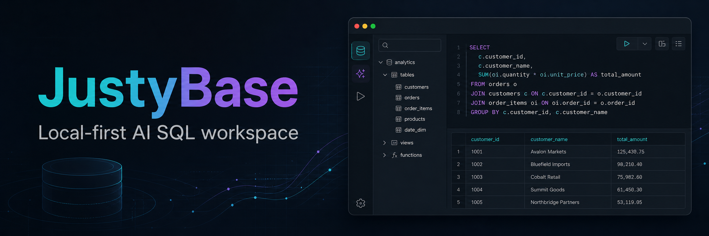
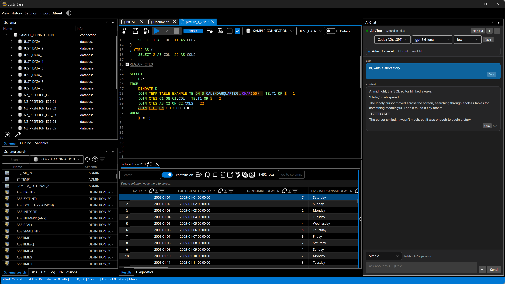
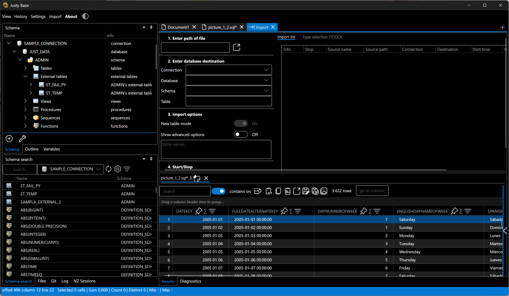
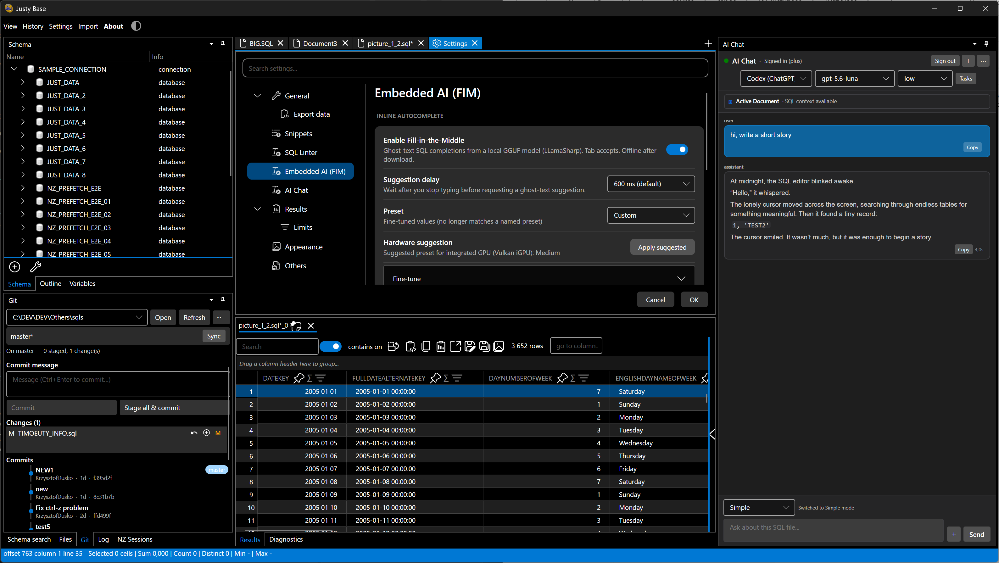
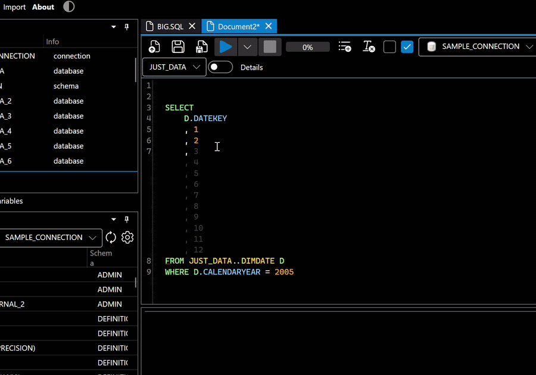
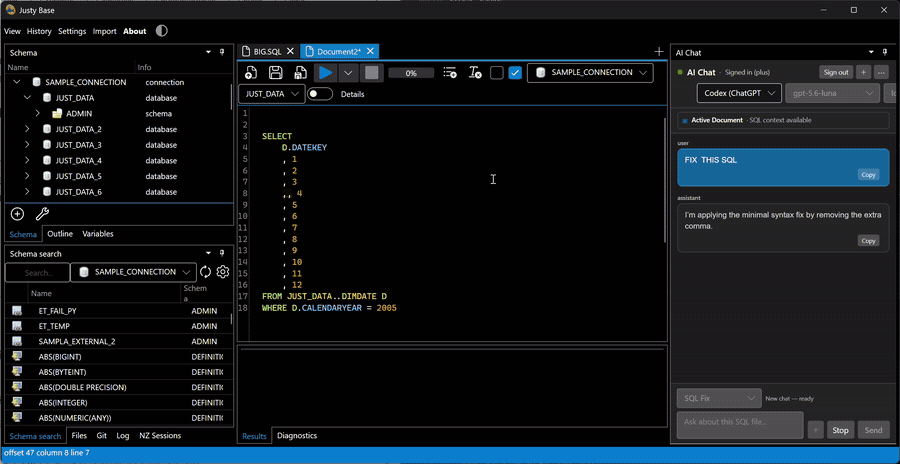
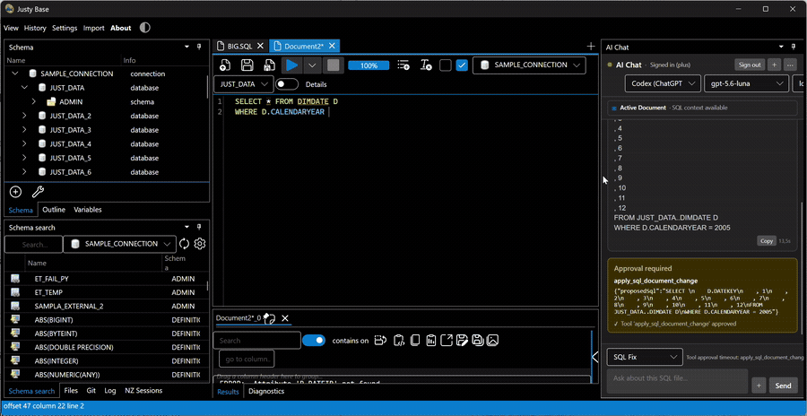

# JustyBase

<p align="center">
  
</p>

<p align="center">
  <strong>Local-first AI SQL workspace for IBM Netezza.</strong><br>
  A fast, privacy-minded desktop IDE for querying, exploring schemas, and shipping SQL.
</p>

[](https://github.com/justybase/justybase/actions/workflows/dotnet-test.yml)
[](LICENSE)
[](https://dotnet.microsoft.com/download/dotnet/10.0)
[](https://github.com/justybase/justybase/releases)
[](https://github.com/justybase/justybase/releases)
[](https://github.com/justybase/justybase/releases)

## Table of contents

- [Overview](#overview)
- [Why JustyBase](#why-justybase)
- [Features](#features)
- [Screenshots](#screenshots)
- [Workflow demos](#workflow-demos)
- [AI and data privacy](#ai-and-data-privacy)
- [Technology stack](#technology-stack)
- [Requirements](#requirements)
- [Quick start](#quick-start)
- [How to build](#how-to-build)
- [Quick verification](#quick-verification)
- [Tests](#tests)
- [Architecture](#architecture)
- [Download](#download)
- [Contributing](#contributing)
- [License](#license)
- [Support](#support)

## Overview

JustyBase is a local-first, cross-platform SQL IDE for IBM Netezza. It brings together a powerful editor, schema exploration, Git-aware workflows, and optional on-device AI assistance—without forcing your SQL workflow into the browser.

## Why JustyBase

If you work with SQL in a desktop environment and want a tool that stays close to the database, keeps the workflow fast, and supports local AI-driven assistance, JustyBase is designed for that balance.

It is especially useful for:

- fast exploratory querying on Netezza,
- interactive schema inspection,
- Git-backed SQL file workflows,
- local AI-assisted authoring and completion.

## Features

- **SQL editor** with syntax highlighting, folding, and autocomplete
- **Quick Open** via `Ctrl+P` for SQL files, docs, file roots, and known explorer paths
- **Embedded FIM AI** for local ghost-text SQL completions via a bundled llama.cpp llama-server (GGUF)
- **Git integration** with status, staging, history, diff, and commit workflow support
- **AI Copilot** for SQL help using Codex/ChatGPT, any OpenAI-compatible endpoint, or an embedded local GGUF model
- **Data grid** with grouping, filtering, and export to Excel, CSV, and Parquet
- **Multi-connection management** for multiple database sessions
- **Netezza-first database support** for IBM Netezza Performance Server
- **Other database engines** (Postgres, DB2, Oracle, DuckDB, MySQL, SQLite) are **coming soon / work in progress** and should not yet be considered generally supported
- **Self-contained ReadyToRun** release packages for deployment without a separately installed .NET runtime

> The hierarchical DataGrid is provided by the official `ProDataGrid` NuGet package and is restored automatically during the normal build.

## Screenshots

Dark theme screenshots are shown below for a consistent presentation.

<p align="center">
  
</p>

| Import workflow | Settings |
|---|---|
|  |  |

## Workflow demos

### Local ghost-text completion



### AI-assisted SQL workflow



### Results exploration and filtering



## Technology stack

* [Avalonia](https://avaloniaui.net/) — cross-platform .NET UI
* [Dock](https://github.com/wieslawsoltes/Dock) — docking layout
* [ProDataGrid](https://github.com/wieslawsoltes/ProDataGrid) — high-performance DataGrid (NuGet 12.0.5)
* [AvaloniaEdit](https://github.com/AvaloniaUI/AvaloniaEdit) — Avalonia-based text editor (port of AvalonEdit)
* [SpreadSheetTasks](https://github.com/justybase/SpreadSheetTasks) — Excel I/O
* [Sylvan CSV](https://github.com/MarkPflug/Sylvan) — fast CSV
* [llama.cpp](https://github.com/ggml-org/llama.cpp) — bundled `llama-server` for embedded FIM and chat (GGUF)
* [Velopack](https://velopack.io/) — desktop updates

## Requirements

- **.NET 10.0 SDK**
- **Windows x64**, **Linux x64**, **macOS ARM64**
- NuGet access to restore **ProDataGrid 12.0.5**

## Quick start

```bash
# 1) Clone the repository
git clone https://github.com/justybase/justybase.git
cd justybase

# 2) Restore, build, and run
dotnet restore JustyBase.slnx
dotnet build JustyBase.slnx -c Debug
cd source/JustyBase
dotnet run
```

On first launch, add an IBM Netezza connection from the schema or connections UI, open a SQL document, and execute a query. Other database connectors are under active development and are not part of the current support commitment.

### Dependencies

| Dependency | How it is resolved |
|------------|--------------------|
| **ProDataGrid** | NuGet package `ProDataGrid` version `12.0.5`. |
| **JustyBase.Netezza\*** | Local `../JustyBase.NetezzaSql` sibling when present (also in `JustyBase.slnx`); otherwise NuGet fallback (`*-*`). CI clones the sibling automatically and forces `UseLocalJustyBaseLibraries=true`. Pin with `-p:JustyBaseNetezzaLibsPackageVersion=...` or force NuGet with `-p:UseLocalJustyBaseLibraries=false`. |

### AI and data privacy

AI features are opt-in and disabled by default. The application supports two local/offline paths and several provider-backed chat paths:

- **Embedded FIM** downloads a user-selected GGUF model from the documented model source and runs inference locally through a bundled llama.cpp `llama-server` subprocess. SQL text used for a suggestion stays on the workstation after the model is downloaded.
- **Embedded AI Chat** hosts a user-selected GGUF chat model (Qwen 3.5/3.6, Gemma 4, Devstral 2) on a second bundled `llama-server` subprocess, with tool calling / agent loop supported.
- **OpenAI Compatible** sends chat prompts and the SQL context selected by the application to the user-configured local endpoint (LM Studio, Ollama `/v1`, llama.cpp, vLLM, …). Their privacy and retention depend on that local service and its configuration.
- **Codex (ChatGPT)** starts the official Codex CLI app-server and uses the user's existing Codex/ChatGPT authentication. The app does not request or persist an OpenAI API key, but the active SQL document and selected metadata can be sent to the provider as part of a chat request.

The application does not expose arbitrary workspace file reads or result-grid rows to the AI tools. SQL execution and document changes require explicit approval in the UI. Credentials are stored in the application's protected local data store; users should still avoid sending confidential SQL or schema information to any remote provider unless their organization's policy permits it. See [docs/EMBEDDED_FIM.md](docs/EMBEDDED_FIM.md), [docs/EMBEDDED_CHAT.md](docs/EMBEDDED_CHAT.md) and [docs/AI_CHAT_CODEX.md](docs/AI_CHAT_CODEX.md) for complete model and provider details.

## How to build

### Standard build

```bash
dotnet build JustyBase.slnx -c Release
```

### Self-contained ReadyToRun publish

```bash
cd source/JustyBase
dotnet publish -r win-x64 -c Release -f net10.0 \
  -p:PublishAot=false -p:PublishReadyToRun=true -p:PublishTrimmed=false \
  --self-contained true
```

Release packaging generates one full database/runtime variant:

- `self-contained`: self-contained ReadyToRun package for the target operating system, including Netezza and DB2.

Examples:

```text
publishWindows.bat <version>
./publishLinux.sh <version> artifacts
./publishMacOS.sh <version> osx-arm64 artifacts
```

The GitHub Actions release workflow builds one self-contained ReadyToRun package per supported operating system. Dynamic plugins and reflection-heavy database providers remain in-process; trimming is disabled for provider compatibility.

Netezza SQL libraries in CI: the workflows clone `justybase/JustyBase.NetezzaSql` next to the `JustyBase` checkout and build with `-p:UseLocalJustyBaseLibraries=true`, so releases and tests compile the same projects as local development instead of resolving floating NuGet versions. Locally the sibling checkout is auto-detected; without it the NuGet fallback (`*-*`) applies.

## Quick verification

```bash
dotnet build .\source\JustyBase\JustyBase.csproj -c Debug
# Launch the app once, connect to a Netezza instance, and then run the live verification test if needed.
dotnet test .\source\JustyBase.LiveTests\JustyBase.LiveTests.csproj -c Debug --filter FullyQualifiedName~ReadmeSqlResultsHero
```

For more details, see [docs/TESTING.md](docs/TESTING.md).

## Tests

```bash
dotnet test source/JustyBase.Tests/JustyBase.Tests.csproj
dotnet test source/JustyBase.HeadlessTests/JustyBase.HeadlessTests.csproj
```

Coverage is published as a CI artifact in Cobertura format. CI status is shown above. For optional live Netezza validation, see [docs/INTEGRATION_TESTS.md](docs/INTEGRATION_TESTS.md).

## Architecture

- Short architectural overview: [docs/ARCHITECTURE.md](docs/ARCHITECTURE.md)
- Engine and plugin maturity matrix: [docs/PLUGIN_CAPABILITIES.md](docs/PLUGIN_CAPABILITIES.md)

## Download

Pre-built releases are available on the [GitHub Releases page](https://github.com/justybase/justybase/releases).

## Contributing

For contribution guidelines and development workflow details, see [CONTRIBUTING.md](CONTRIBUTING.md).

## License

This project is licensed under the MIT License. See [LICENSE](LICENSE) for details.

## Support

- [GitHub Issues](https://github.com/justybase/justybase/issues)
- Active project development and ongoing maintenance
