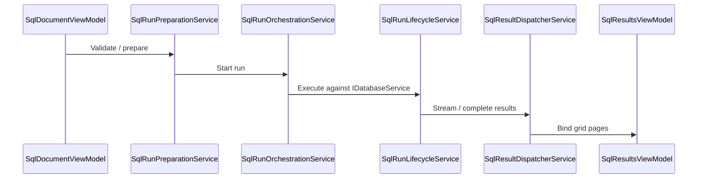

# Architecture

JustyBase is an Avalonia desktop SQL IDE with a plugin-based database layer.

## Layers

```text
JustyBase (UI host: Views, ViewModels, app services)
  ├─ SqlEditor.Avalonia          # SQL editor control (+ optional FIM ghost text)
  ├─ JustyBase.Ai.Embedded       # Embedded llama.cpp (llama-server) models & subprocesses
  ├─ JustyBase.Common            # config, contracts, shared models
  ├─ JustyBase.PluginCommon      # IDatabaseService and plugin contracts
  ├─ JustyBase.PluginBase        # DatabaseService base + plugin loader
  └─ Plugins/*                   # Netezza, Postgres, MySQL, ...
```

External:

- **ProDataGrid** — NuGet dependency for DataGrid / hierarchical schema tree
- **JustyBase.NetezzaSql** packages (or local sibling) — parser, DDL, catalog SQL

## UI composition

- **MVVM** with CommunityToolkit.Mvvm and Dock documents/tools
- **DI** via `Microsoft.Extensions.DependencyInjection` (`ServiceCollectionExtensions`)
- Views are resolved by `ViewLocator` (constructor injection preferred over service locator)

## Embedded AI (optional)

Local **Fill-in-the-Middle** SQL ghost text — served by a bundled llama.cpp `llama-server` subprocess — and the same FIM server for **Git commit message** drafts (plain completion, not FIM tokens). A second llama-server subprocess hosts the **Embedded (local)** AI chat backend with tool calling.

- User guide: [EMBEDDED_FIM.md](EMBEDDED_FIM.md)
- Interface: `ICompletionProvider` in `JustyBase.Ai.Embedded`; commit messages via `IGitCommitMessageAiService`
- Editor: `InlineCompletionController` (configurable debounce, Tab accept)
- Settings (`AppOptions`): `EnableFimServer` / `EnableEmbeddedChatAi` (default off), model ids / presets / delay / GPU knobs (see EMBEDDED_FIM.md)
- Models downloaded to `%LOCALAPPDATA%/JustyBase/models/`; llama-server binary to `%LOCALAPPDATA%/JustyBase/llama-server/`
- Native AOT: the engine is an external native process, so there is no AOT impact on the JustyBase binary

## Git tool

Dock tool for local Git repos: status, stage/commit, pull/push/sync, branches, history/timeline, and a non-floating **Diff** document for file previews.

## SQL run flow (simplified)



## Plugins

Each engine plugin:

1. Inherits `DatabaseService`
2. Declares `public const DatabaseTypeEnum WHO_I_AM_CONST = ...`
3. Implements dialect-specific DDL/schema helpers behind `IDatabaseService` (composed of smaller contracts)

Connection instances are owned by `DatabaseServiceRegistry` (DI singleton; also reachable via `IDatabaseServiceResolver`). Static `DatabaseServiceHelpers` remains for driver-name maps and plugin registration.

Runtime plugins can also load from the plugins directory when configured.

Maturity by engine: [PLUGIN_CAPABILITIES.md](PLUGIN_CAPABILITIES.md).

## Cross-cutting

- Credentials stored encrypted under `%AppData%\JustDataEvo`
- Logging redacts connection secrets
- Update feed integration was removed; the app no longer depends on a remote update feed URL
- Native AOT publish path for Windows/Linux
